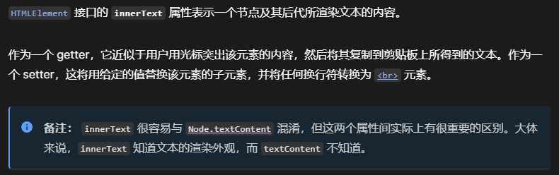

# innerText

### 输出
- 一个字符串，代表元素的渲染文本内容。
- 如果元素本身没有被渲染（例如，从文档中分离出来或从视图中隐藏起来），返回值与 Node.textContent 属性相同。

*注意：innerText会触发重绘*

警告：在一个节点上设置 innerText 会移除该节点的所有子节点，并用给定的字符串值的单一文本节点代替它们。

****

# innerHTML

innerHTML 属性设置或获取 HTML 语法表示的元素的后代

**备注：如果一个 `
`, ``, 或 `<noembed>` 节点有一个文本子节点，该节点包含字符 (&), (<), 或 (>), innerHTML 将这些字符分别返回为 &amp;, &lt; 和 &gt;。使用Node.textContent 可获取一个这些文本节点内容的正确副本。**

*注意：innerHTML存在安全问题*

- HTML5中指定不执行由innerHTML插入的`<script>`标签
- 还有其它方式不依赖`<script>`的方式，比如``
- 插入纯文本，建议不使用innerHTML

# textContent

- textContent 属性设置或获取一个元素及其后代的文本内容 包含隐藏元素、script、style
- 给节点设置textContent会移除所有子节点，并替换为包含相应文本的单个文本节点

*使用textContent可以防止XSS攻击*

