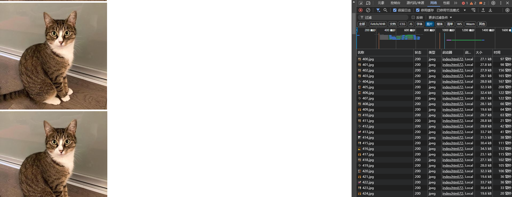
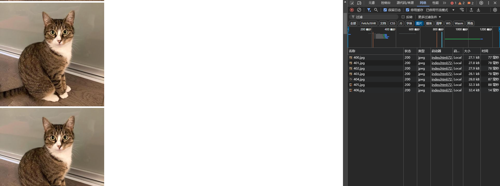

# 图片懒加载

## 什么是图片懒加载

图片懒加载是一种优化网页性能的技术，它通过延迟加载图片资源，直到用户滚动到图片所在的区域，从而减少页面初始加载时的资源消耗。

## 为什么要使用图片懒加载

1. 提高页面加载速度：通过延迟加载图片，可以减少页面初始加载时的资源消耗，从而提高页面加载速度。
2. 节省带宽：通过延迟加载图片，可以减少页面初始加载时的带宽消耗，从而节省带宽。
3. 提高用户体验：通过延迟加载图片，可以提高用户体验，从而提高用户体验。
4. 浏览器有并发请求限制，图片懒加载可以减少并发请求数。

## 图片懒加载的实现

1. 设置图片的 loading 属性为 lazy（loading 就两个值，lazy 和 eager，默认是 eager，lazy 是懒加载，eager 是立即加载）
```
const img = document.createElement("img");
img.src = "图片地址";
img.loading = "lazy";
img.width = 400; // 设置图片宽度
img.height = 400; // 设置图片高度
```
**注意：没有设置图片的宽高时，图片会立即加载**

<u>可能浏览器专门做了什么处理？</u>

>为图片添加尺寸属性
>浏览器在加载图片时，除非明确指定图片的尺寸，否则不会立即知道图片的尺寸。为了让浏览器在网页上为图片预留足够的空间，并避免出现干扰性的布局偏移，建议为所有`img`标签添加 width 和 height 属性。

这是没有设置图片的宽高时，图片会立即加载


这是设置了图片的宽高时，图片会懒加载



<u>经测试，通过`'loading' in HTMLImageElement.prototype`检查返回的都是true，`google`和`edge`浏览器上都能正常生效，但是火狐不生效，</u>

2. 使用 `IntersectionObserver` API 监听图片的可见性

```
const img = document.createElement("img");
img.setAttribute("data-src", "图片地址");
const observer = new IntersectionObserver((entries, observer) => {
  entries.forEach(entry => {
    if (entry.intersectionRatio > 0) { // intersectionRatio表示交叉区域占整个元素的比例，大于0表示交叉了
      entry.target.src = entry.target.dataset.src;
      observer.disconnect(); // 停止监听
    }
  });
}, {
  rootMargin: "500px 0px 500px 0px",
  root: null // 监听该元素和root的交叉区域，默认是文档视口，设置null跟不设置一样。
});
observer.observe(img);
```

`rootMargin` 用来设置元素距离根元素的距离，可以设置四个值，分别表示上、右、下、左的距离。
这里设置的`500px`，表示元素距离根元素的距离为`500px`，也就是说，当元素距离根元素的距离小于`500px`时，就表示两者交叉了，设置为`-500px`，表示实际交叉大于`500px`才算相交。

